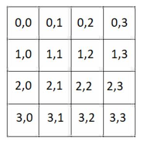
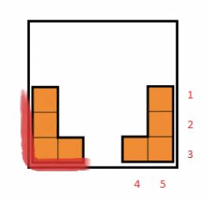
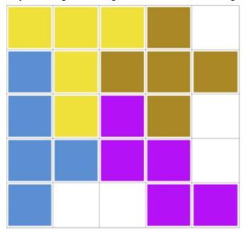

# Tetris

Znajdowanie najmniejszego kwadratu, mieszczącego\
określoną listę klocków

Opis zadania

Celem programu jest znalezienie najmniejszego kwadratu, który pomieści
otrzymaną listę klocków i zwrócenie możliwych rozłożeń klocków. Klocek
rozumiemy jako zbiór połączonych ze sobą kwadratów o polu 1. Klocki nie
mogą na siebie nachodzić.\
Parametrem programu jest lista obiektów reprezentujących klocki o tym
samym polu.

### Przykład:

Dane wejściowe:

{width="4.75834208223972in"
height="2.118332239720035in"}

Najmniejszy kwadrat, który zmieści dany zbiór klocków ma bok równy 4.

Przykładowe ułożenie:

{width="2.54752624671916in"
height="2.369792213473316in"}

Każda komórka kwadratu będzie identyfikowane przez parę z indeksem
wierszu i kolumny. Kwadrat o boku 4 reprezentujemy w następujący sposób:

{width="2.2463495188101485in"
height="2.2850798337707787in"}

Dla każdego klocka generujemy listę współrzędnych kwadratu, w których
możemy umieścić dany klocek, zakładając że kwadrat jest pusty. W celu
ustalenia współrzędnych, klocek wpisujemy w najmniejszy możliwy
prostokąt. Następnie dla każdego pola kwadratu, sprawdzamy czy prostokąt
z wpisanym klockiem może zostać wycięty do kwadratu, tak aby klocek w
całości należał do kwadratu. Wycinanie do kwadratu polega na
przeniesieniu elementów prostokąta, w ten sposób, że lewy górny element
prostokąta odpowiada wybranemu polu kwadratu.

Weźmy następujący klocek:

{width="1.1197922134733158in"
height="1.4771719160104988in"}

Punkty kwadratu o boku 4, w które możemy wpisać dany klocek to: (0,0),
(1,0), (0,1), (1,1), (0,2), (1,2).

Klocek można obracać, więc podobną listę generujemy dla każdej możliwej
pozycji klocka.

# Algorytm dokładny

## Opis algorytmu

Pierwszym krokiem jest znalezienie wymiarów najmniejszego kwadratu,
który mógłby potencjalnie być rozwiązaniem. W tym celu, sprawdzamy pole
dowolnego klocka z listy ($n$), a następnie mnożymy je przez ilość
elementów na liście ($k$). Wystarczy sprawdzić tylko jeden klocek, bo
wszystkie muszą mieć równe pole.

Pierwszym rozważanym przez nas kwadratem będzie kwadrat o boku:

$a\  = \ $

Otrzymaną wartość należy zaokrąglić w górę.

Aby sprawdzić, czy klocki zmieszczą się w wyznaczonym kwadracie,
wykorzystamy algorytm z nawrotami.

Działamy po kolei na klockach wejściowej listy. Dla przetwarzanego
klocka, iterujemy po liście możliwych ułożeń klocka w pustym kwadracie,
sprawdzając, czy dane ułożenie można umieścić w częściowo
wypełnionym(lub nie) kwadracie, tak aby klocki na siebie nie nachodziły.
Ruchem nazywamy położenie klocka w kwadracie. Jeśli żaden ruch nie może
zostać wykonany, to wykonujemy podobne sprawdzenie dla tego samego
klocka, ale obróconego o 90, 180 i 270 stopni (jeśli klocek będzie się
różnił).

1.  Jeśli udało nam się wykonać ruch, przechodzimy do kolejnego klocka z
    > wejściowej listy

2.  Jeśli nie udało się wykonać ruchu, wracamy do poprzedniego klocka i
    > próbujemy wykonać inny ruch.

Jeśli uda nam się umieścić ostatni klocek w kwadracie, oznacza to że
znaleźliśmy rozwiązanie. W tej sytuacji sprawdzamy wszystkie możliwe
ułożenia, zapisując rozwiązania, a następnie zwracamy wynik. W
przeciwnym wypadku, zwiększamy długość boku kwadratu o jeden i ponawiamy
algorytm. Czynność powtarzamy aż do znalezienia rozwiązania.

## Dowód poprawności

## Jako że w wynikowym kwadracie, klocki nie mogą na siebie nachodzić, najmniejszy kwadrat, który mógłby być rozwiązaniem ma pole równe sumie pól danych klocków. Dlatego nie rozważamy mniejszych kwadratów. Przedstawiony algorytm sprawdza wszystkie możliwe ułożenia klocków w kwadracie określonego rozmiaru, a zatem jeśli rozwiązanie istnieje, to zostanie znalezione. W przypadku braku rozwiązania, pole wynikowego kwadratu jest zwiększane. Algorytm rozpoczynamy dla kwadratu minimalnej wielkości, stopniowo go zwiększając, dlatego znalezione rozwiązania będą optymalne. Skoro lista i klocki w niej zawarte są skończonego rozmiaru, to algorytm zawsze zakończy się, zwracając wynik. 

## Analiza złożoności

Długość boku pierwszego rozważanego kwadratu jest równa $a\  = \ $
zaokrąglone w górę, gdzie n oznacza liczbę klocków, a k wielkość
pojedynczego klocka. Zatem jego pole jest równe $a^{2}$. Pierwszy klocek
z listy możemy ustawić na maksymalnie $4a^{2}$sposobów, ponieważ dla
każdej komórki kwadratu, w najgorszym wypadku mamy 4 różne ustawienia po
obrotach. Następny klocek można ustawić na $4{(a}^{2} - k)$ sposobów, bo
k pól zostało zajęte przez pierwszy klocek.

Zatem klocki w kwadracie o takim boku możemy ustawić na

$(4a^{2})4{(a}^{2} - k)4(a^{2} - 2k)...4(a^{2} - nk)\ $

sposobów.\
Jako że musimy niedeterministycznie sprawdzić wszystkie możliwe
ustawienia klocków, złożoność rozwiązania będzie co najmniej
wykładnicza.

# Algorytm heurystyczny

## Opis algorytmu

Algorytm heurystyczny będzie najbardziej zbliżony do prawdziwej gry w
tetris. Jeżeli w dokładnym rozwiązaniu kolejność klocków nie miała
znaczenia, to ten algorytm będzie ją uwzględniać, czyli będzie symulować
decyzję gracza przy kolejnie pojawiającym się klocku. Porządek klocków
jest określony w tej kolejności w jakiej one są podane do algorytmu. Jak
w poprzednim rozwiązaniu na początku wyznaczamy rozmiar boku
potencjalnego najmniejszego kwadratu. Dalej biorąc każdy kolejny klocek
z listy próbujemy go ustawić w kwadracie tak, aby zminimalizować ilość
dziur. Przy próbach ustawienia możemy obracać klocek kolejno o 90, 180 i
270 stopni tak, aby uzyskać najlepszy wynik. Przyjęliśmy założenie, że
najbardziej korzystnym ustawieniem będzie takie, w którym długość
stykających się powierzchni między ustawionym klockiem i klockami już
ustawionymi lub krawędziami kwadratu będzie maksymalna. Jeżeli w pewnym
momencie nie można będzie ustawić klocek na żaden sposób, to zwiększamy
o jeden bok kwadratu i wykonujemy algorytm ponownie, aż do skutku.

#### Rozważmy przykład:

Dane wejściowe - 5 klocków o rozmiarze 4. Najmniejszy kwadrat w który
możemy ułożyć klocki ma bok 5.

{width="5.129372265966754in"
height="1.1247123797025371in"}

Przy wstawieniu pierwszych dwóch klocków najkorzystniejsze ustawienie
będzie po bokach, wtedy długość stykających się powierzchni równa się 5.

{width="2.2411417322834644in"
height="2.1623075240594924in"}

Rozważmy wszystkie możliwości ustawienia kwadratu. Mamy łącznie 8
możliwości, ale ponieważ są one symetryczne siebie, zwrócimy uwagę tylko
na cztery przypadki.

{width="1.578082895888014in"
height="1.5985772090988626in"}{width="1.4920450568678916in"
height="1.369410542432196in"}{width="1.4440376202974627in"
height="1.3626837270341208in"}{width="1.399397419072616in"
height="1.369410542432196in"}

Algorytm wybierze ułożenie jak na pierwszym obrazku, bo ma największą
długość stykających się powierzchni.

Po zakończeniu działania algorytmu ułożony kwadrat będzie wyglądać
następująco. Jest to najlepsze możliwe rozwiązanie, bo udało się
umieścić wszystkie klocki w najmniejszym możliwym kwadracie. Liczba
dziur wynika z ilości i rozmiaru klocków.

{width="1.9250120297462816in"
height="1.9163790463692039in"}

## Dowód poprawności

Każdy klocek może być postawiony na skończonej liczbie miejsc. Jeżeli
jakiś klocek z listy nam się nie zmieści, to algorytm zwiększa bok
kwadratu. Wiemy że ilość takich zwiększeń będzie ograniczona, bo
istnieje taki kwadrat, który na pewno zmieści wszystkie klocki (na
przykład kwadrat o boku n\*k, gdzie każdy klocek jest ułożony wzdłuż
krawędzi). Natomiast nasz algorytm skończy się wcześniej (wynika to z
zastosowanego sposobu wybierania najlepszego ustawienia klocka), bo
umieszczenie każdego klocka wzdłuż krawędzi jest bardzo nieoptymalne i
przy tych samych danych wejściowych potrzebnie by było więcej razy
zwiększać bok kwadratu.

## Analiza złożoności

Przeanalizujemy złożoność algorytmu za pomocą pseudokodu.

{width="4.444267279090114in"
height="2.6587970253718285in"}

Operację rate_location, choose_location, place_tetromino oraz
przepisanie, inkrementacja zmiennej mają złożoność rzędu O(c), gdzie c -
pewna stała.

Dla wyznaczenia końcowej złożoności algorytmu spróbujmy oszacować ilość
razy potencjalnego zwiększania kwadratu.

Wyobraźmy sobie taki przypadek, kiedy klocek już się nie mieści do
kwadratu. Nasz algorytm będzie próbował ułożyć kwadrat o boku o 1
większym, ale w celu wykonania szacowania, spróbujmy ułożyć klocek
prostopadle do krawędzi kwadratu. (to jest pesymistyczny przypadek). Tym
samym otrzymamy kwadrat wypełniony wszystkimi klockami. Czyli możemy
powiedzieć, że w najgorszym przypadku nasz minimalny kwadrat się
zwiększy o długość pozostałych klocków - p\*k, gdzie p - liczba
niemieszczących się klocków.

Złożoność zagnieżdżonych pętli równa się iloczynu złożoności każdej z
nich. Czyli złożoność algorytmu
${4\ *\ l}^{}\ *\ n^{2}\  \leq p*\ k\ *\ (k\ *\ n)\ *n\ *\ 4\  = \ {4\ *\ k}^{2}\ *\ n^{2}$,
gdzie l - to ilość razy zwiększenia boku kwadratu.

Wyznaczanie najmniejszego zbioru cięć listy klocków, mogącego wypełnić
prostokąt

# Opis zadania

Celem programu jest znalezienie najmniejszego zbioru przecięć wejściowej
listy klocków, aby pocięte klocki mogły całkowicie wypełnić prostokąt o
polu równym sumie pól danych klocków. Klocek rozumiemy jako zbiór
połączonych ze sobą kwadratów o polu 1. Klocki nie mogą na siebie
nachodzić. Rozważać będziemy prostokąt najbliższy kwadratowi, czyli
którego różnica długości boków będzie najmniejsza.

Cięcia mogą być wykonywane tylko i wyłącznie wzdłuż linii będącymi
granicami małych kwadratów. Cięcia mogą być dowolnej długości, więc oba
poniższe cięcia są dozwolone:

Długość cięć równa 2:

{width="5.489583333333333in"
height="1.9895833333333333in"}

Długość cięć równa 1:

{width="5.885416666666667in"
height="1.9791666666666667in"}

Parametrem programu jest lista obiektów reprezentujących klocki o tym
samym polu.

### Przykład:

Dane wejściowe:

{width="3.347228783902012in"
height="1.9171194225721784in"}

Pole klocków jest równe 12. Prostokąt o takim polu, najbliższy
kwadratowi ma wymiary 3 x 4.

Szukamy minimalnego zbioru cięć na wejściowych klockach, aby nowo
powstały zbiór klocków mógł wypełnić wyznaczony prostokąt.

{width="2.6458333333333335in" height="1.84375in"}

Na niebieskim klocku wykonano cięcie o długości 1. Łączna długość cięć
wynosi 1 i nie istnieje zbiór cięć o krótszej łącznej długości, który
wygeneruje klocki mogące wypełnić rozważany prostokąt.

# Algorytm dokładny

## Opis algorytmu

Dla wejściowego n-elementowego zbioru klocków najpierw znajdujemy
prostokąt najbliższy kwadratowi - liczymy łączne pole klocków, potem
znajdujemy najbliższe sobie liczby, których iloczyn jest równy temu
polu.

Dla każdego z rodzaju klocków, wykonujemy wszystkie możliwe cięcia i
złączenia pociętych części i zapamiętujemy je jako parę: liczba cięć i
zbiór powstałych w wyniku cięć klocków (przetrzymujemy je podobnie jak
same klocki)- ułatwi to późniejsze cięcie klocków i dopasowywanie ich w
wolne miejsca.

Przykład:

{width="0.8333333333333334in" height="1.21875in"}

{width="5.098958880139983in"
height="2.6172397200349957in"}

Następnie znajdujemy permutacje z powtórzeniami zbioru wejściowego
klocków.

Dla przykładowego zbioru:

{width="5.463542213473316in"
height="1.388575021872266in"}

Będzie to $\frac{6!}{2!*3!}$

Dla każdej z tych permutacji będziemy zaczynać obliczenia, które w
pierwszym etapie są bardzo podobne do algorytmu z zadania z kwadratem.
Dla każdego rodzaju i każdego obrotu klocków znajdujemy możliwe do
ustawienia pozycje w prostokącie. Później, biorąc pierwszy klocek z
listy, ustawiamy go na pierwszej wolnej pozycji. Jeśli ustawienie klocka
w żadnym z obrotów nie jest możliwe, sprawdzamy dla kolejnych klocków i
jeśli można je umieścić w prostokącie, to umieszczamy. Jeśli uda się
wypełnić prostokąt wszystkimi klockami, to kończymy obliczenia i
prezentujemy wynik.

W momencie gdy nie możemy już umieścić żadnego z pozostałych klocków w
prostokącie, następuje etap cięć. Powstałe w prostokącie wolne miejsca
zapisujemy w podobny sposób jak klocki. Mając zbiór wolnych miejsc do
wypełnienia i pozostałe klocki wraz z wcześniej przygotowanymi dla nich
cięciami, następuje dopasowanie klocków i wybór cięć, aby wykonać ich
jak najmniejsza liczbę. Dla każdego z pozostałych klocków sprawdzamy
najpierw czy wykonując po jednym cięciu, można wpasować powstałe kawałki
w wolne miejsca. Robimy to w taki sposób, że najpierw łączymy w pary
puste miejsca i przecięte kawałki o jednakowym kształcie, a następnie
pozostałe pocięte kawałki wpasowujemy w brakujące miejsca algorytmem z
powrotami w analogiczny sposób jak wpasowywaliśmy niepocięte klocki w
prostokąt. Jeśli dla klocków możliwe jest wykonanie jednego cięcia na
więcej niż jeden sposób, to sprawdzamy każdą kombinacje między klockami.
Jeśli nie udało się dopasować kawałków, to zwiększamy całkowitą liczbę
cięć o jeden, również sprawdzając wszystkie kombinacje dla danej liczby
cięć. Powrót następuje w przypadku wypełnienia całego prostokąta w
najmniejszej jak dotąd liczbie cięć (zapamiętujemy wtedy wynik) lub przy
przekroczeniu najmniejszej jak dotąd liczby cięć.

## Dowód poprawności

## Przedstawiony algorytm sprawdza wszystkie możliwe ułożenia klocków w prostokącie i dla każdego z ułożeń sprawdza pocięcia. Algorytm sprawdza układanie klocków w każdej możliwej kolejności, aby w przypadku zaistnienia takich samych układów pustych miejsc, sprawdzić każdy możliwy do powstania układ klocków do pocięcia. 

Poniewaz sprawdzane sa wszytkie mozliwe sytuacje, to na pewno zostanie
znalezione rozwiązanie z najmniejsza liczbą pocięć.

## Analiza złożoności

## W pesymistycznym przypadku, kiedy w wejściowym n-elementowym zbiorze klocków o rozmiarze k, każdy klocek będzie innego rodzaju, to permutacji tego zbioru będzie n! Pierwszy klocek z listy można ustawić na maksymalnie 4\*k\*n sposobów, bo prostokąt ma pole równe k\*n, a klocek w najgorszym wypadku ma 4 różne ustawienia po obrotach. Następny klocek można ustawić na (4\*k\*n - k) sposobów, bo k pól zostało zajętych przez pierwszy klocek. W momencie gdy nie możemy ustawić już żadnego klocka, a liczba klocków, które nam zostały jest równa m, przechodzimy do etapu cięcia gdzie korzystamy z wcześniej przygotowanych wzorów. Jako że musimy niedeterministycznie sprawdzić wszystkie możliwe ustawienia klocków, a dodatkowo wykonać cięcia, złożoność rozwiązania będzie co najmniej wykładnicza.

# Algorytm heurystyczny

## Opis algorytmu

Algorytm będzie bardzo podobny do heurystycznego algorytmu dla kwadratu.
Na początku znajdujemy rozmiar najmniejszego prostokąta, najbardziej
zbliżonego do kwadratu, którego pole będzie się równać łącznemu polu
wszystkich klocków podawanych dla algorytmu. Po wyznaczeniu rozmiarów
prostokąta będziemy imitować podejmowanie decyzję przez użytkownika przy
pomocy metody oceniania ułożenia klocka według długości stykających się
krawędzi (jak w kwadracie). Jedyną różnicą w działaniu algorytmów będzie
działanie podejmowane w przypadku, kiedy klocek się nie mieści do
figury. W przypadku prostokąta w tym momencie zaczynamy ciąć klocek, tak
aby z najmniejszą długością cięć udało się zmieścić go w prostokącie. Po
umieszczeniu wszystkim klocków algorytm się kończy. Warto też zauważyć,
że nie może być przypadku, kiedy po zakończeniu działania algorytmu w
prostokącie zostaną dziury, bo prostokąt może być ostatecznie wypełniany
klockami o polu 1.

## Dowód poprawności

Każdy klocek może być postawiony na skończonej liczbie miejsc. Po
zakończeniu ustawiania, zostaje nam skończona liczba klocków i skończona
liczba pustych miejsc, więc wypełnianie po kolei pustych miejsc jest
również skończone. Z tego wynika, że nasz algorytm zawsze się skończy.

Jeśli po etapie ustawiania nie zostanie nam żadne puste miejsce, to
znaczy, że otrzymaliśmy poprawny wynik bez cięć. Jeśli nie, to
przechodzimy do etapu cięć i wypełniania pustych miejsc. Jako, że łączne
pole powierzchni pustych pól musi być równe łącznemu polu powierzchni
pozostałych klocków, to algorytm w najgorszym wypadku potnie klocki na
jednostkowe kwadraty i w dowolny sposób wypełni nimi puste miejsca, ale
znajdzie poprawne (niekoniecznie optymalne) rozwiązanie.

## Analiza złożoności

Wypełniany prostokąt ma pole n\*k, gdzie n to liczba klocków, a k to ich
wielkość. Pierwszy klocek może zostać postawiony maksymalnie na $4nk$
sposobów (w każdej komórce prostokąta na 4 różne obroty). Następny
klocek możemy położyć już na $4(nk\  - \ k)$ sposobów, gdyż poprzedni
klocek zajmuje k miejsc. Klocek k-elementowy możemy pociąć na
maksymalnie na

{width="1.4338495188101488in"
height="0.3889698162729659in"}

sposobów.

Zatem całkowita złożoność jest równa

$p\ *\ (4nk + 4nk - 4k + 4nk - 8k + ... + 4nk - 4k^{2})\  \leq p\ *\ 4n^{2}k$

Opis programu

## Uruchomienie i wymagania systemowe

Komputer z systemem operacyjnym Windows 10 kompatybilny z .NET Framework
4.7.2.

Plik .exe będzie załączony w folderze z projektem pod ścieżką względną -
plik wykonywalny/Tetris.exe.

Zakładamy, że wszystkie klocki dalej wspomniane są klockami o rozmiarze
5, czyli pentomino.

Program posiada opcję wybierania typu problemu i typu algorytmu
reprezentowaną za pomocą radio buttons.

Istnieją trzy opcje przekazania zestawu klocków reprezentowane w GUI:

1.  \[Load from file\] - Wczytanie pliku. Program otwiera okno wyboru
    > pliku (File Dialog) i pozwala wczytać plik w formacie txt.

2.  \[Random\] - Generowanie losowych klocków o ilości ustalonej przez
    > użytkownika. Wygenerowane liczby pojedynczych klocków są
    > wyświetlane w polach textowych pod odpowiednimi klockami i są
    > modyfikowalne.

3.  \[Load from keyboard\] - Ręczne wpisywanie liczby klocków w polach
    > testowych.

Przy wczytywaniu pliku tekstowego w którym jest zdefiniowane kilka
problemów jest dostępny przycisk \[Next task\]. Żeby przejrzeć wszystkie
problemy trzeba najpierw wyświetlić klocki z pierwszego problemu za
pomocą \[Show pieces\], a następnie posługiwać się przyciskiem \[Next
task\], który będzie zmiał widok GUI w zależności od zdefiniowanego
problemu. Jeżeli w pliku już nie ma więcej dotępnych problemów -
przycisk się blokuje. Również jest wyświetlany licznik który pokazuje
który problem aktualnie przeglądamy i ile jest sprecyzowanych w pliku.

\[Show pieces\] - Wyświetla wybrany/wygenerowany zestaw klocków

\[Solve\] - Uruchamia odpowiedni algorytm dla wybranego zestawu klocków
oraz wyświetla rozwiązanie/rozwiązania. W trakcie obliczeń algorytmu
wyświetla się napis "Processing\...". W przypadku dokładnych algorytmów
wyświetla pierwsze rozwiązanie. Użytkownik może wyświetlić dowolne inne
rozwiązanie zmieniając numer rozwiązania za pomocą strzałki lub wpisując
ręcznie dowolny numer z zakresu wszystkich rozwiązań i następnie
klikając w przycisk \[Go\].

Uwaga: Aby po kliknięciu przycisku \[Solve\] przy losowym generowaniu
klocków zobaczyć ponownie użyte klocki, należy zmienić opcję na \[Load
from keyboard\], w przeciwnym wypadku zostanie wygenerowany nowy zestaw
klocków.

W celach optymalizacji programu przyjęliśmy że ustalimy domyślny
\[solution limit\] - limit rozwiązań(10) dla algorytmów dokładnych. Ta
opcja może być wyłączona przez użytkownika lub limit może być
zmodyfikowany.

Po zakończeniu wykonywania algorytmu zaczyna się generować plansza. Po
wygenerowaniu planszy wyświetla się rozwiązanie oraz dodatkowe
informację takie jak czas wykonania algorytmu w s(generowanie planszy
nie jest wliczane) i minimalna liczba cięc dla algorytmów z prostokątem.

Format pliku:

Daną wejściową może być plik przygotowany w następujący sposób:

\- W pierwszej linijce wielkość dla jakich klocków algorytm działa -
jednak nasz program obsługuje tylko klocki 5 elementowe i nie obsługuje
formatu w którym w pierwszej linijce znajduje się cokolwiek innego niż
5.

\- W drugiej linijce jedna z następujących wartości: \"ok\", \"hk\",
\"op\", \"hp\" (małymi literami) oznaczające jaki algorytm powinien się
uruchomić, kolejno:

1.ok - problem kwadratu, algorytm optymalny,

2.hk - problem kwadratu, algorytm heurystyczny,

3.op - problem prostokąta, algorytm optymalny,

4.hp - problem prostokąta, algorytm heurystyczny,

\- W trzeciej linijce może znajdować się jedna liczba, lub lista liczb
oddzielonych spacjami:

1.jeśli jest jedna liczba to informuje nas ona dla ilu losowo wybranch
klocków powinniśmy uruchomić nasz algorytm,

2.jeśli jest więcej niż jedna liczba to jest to lista ilości kolejnych
klocków dla których powinniśmy uruchomić nasz algorytm (ignorujemy zera
końcowe) np. 2 5 1 1 0 0 5 3 oznacza, że powinniśmy wziąć 2 klocki o
numerze 1, 5 klocków o numerze 2, 1 klocek o numerze 3 itd.

{width="5.661458880139983in"
height="2.2852734033245845in"}

Klocki i odpowiadające im numery przestawione są poniżej:

{width="6.267716535433071in"
height="2.2083333333333335in"}

Przykład rozwiązania algorytmem heurystycznym dla pierwszego problemu z
przykładu:

{width="6.267716535433071in"
height="4.611111111111111in"}

## Przykłady

Zestaw omówionych przykładów znajduje się w pliku przyklady.txt

Kwadrat

Algorytm heurystyczny dla kwadratu o następującym zestawie klocków:

1 1 1 2 0 2 3 2 0 1 0 1 0 1 1 0 2 1

generuje plansze:

{width="4.061122047244094in"
height="3.9059634733158357in"}

Algorytm heurystyczny dla kwadratu o następującym zestawie klocków:

0 0 0 0 0 0 0 0 0 1 0 0 1 1 1 0 0 0

generuje plansze:

{width="2.843494094488189in"
height="2.722494531933508in"}

Natomiast algorytm dokładny dla tego samego zestawu klocków generuje
plansze:

{width="2.748561898512686in"
height="2.6351301399825022in"}

Algorytm optymalny zmieścił podany zestaw klocków w kwadracie o boku 5,
natomiast algorytm heurystyczny potrzebował kwadratu o boku 6, co
pokazuje, że algorytm heurystyczny nie zawsze zwraca optymalne
rozwiązanie.

Prostokąt

Algorytm heurystyczny dla prostokąta o zestawie klocków

0 1 1 0 0 2 0 1 2 0 1 0 2 0 1 0 1 0

Generuje plansze:

{width="3.7513899825021872in"
height="3.6142968066491687in"}

Wykonując przy tym cięcia o łącznej długości 5.

Algorytm heurystyczny dla prostokąta o zestawie klocków:

0 0 0 0 0 1 0 0 0 1 1 0 0 0 1 0 0 0

Generuje plansze:

{width="2.88121719160105in"
height="2.758938101487314in"}

Wykonując przy tym cięcia o łącznej długości 2 (tniemy dwukrotnie klocek
Y)

Natomiast algorytm optymalny dla tego samego zestawu klocków zwraca
planszę:

{width="3.033847331583552in"
height="2.8851301399825022in"}

W tym przypadku, długość cięcia wynosi 1 (jednokrotnie obcinamy klocek
Y), co pokazuje, że algorytm heurystyczny nie zawsze zwraca optymalne
rozwiązanie.

## Analiza wydajności

Analiza wydajności została dokonana na podstawie uśrednionego czasu
pięciu pomiarów przy użyciu losowych klocków. Wyniki są następujące:

{width="5.0in" height="3.0in"}

{width="5.0in" height="3.0104166666666665in"}

W obu przypadkach można zauważyć wykładniczy wzrost czasu wykonania.
Szczególnie znaczący dla użytkownika wzrost następuję około czterech lub
pięciu klocków.

Nadanie limitu wyświetlanych rozwiązań skraca czas wykonania algorytmu.

{width="5.010416666666667in" height="3.0in"}

{width="5.010416666666667in"
height="3.0104166666666665in"}

Czasy wykonań algorytmów przybliżonych zdają się, zgodnie z
obliczeniami, rosnąć wielomianowo. Nawet dla dużych liczb klocków są one
niezauważalne dla użytkownika.

## Lista zmian:

-   Ustaliliśmy stałą wielkość klocka: 5

-   W algorytmie dokładnym dla prostokąta oprócz zapamiętywania pocięć
    > dla każdego rodzaju klocka, zapamiętujemy pocięcia dla kombinacji
    > klocków

-   Dodaliśmy możliwość limitowania liczby wyświetlanych rozwiązań

-   Generowanie i zapamiętywanie rotacji dla klocków
